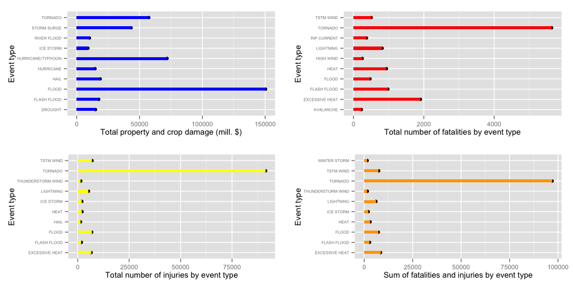
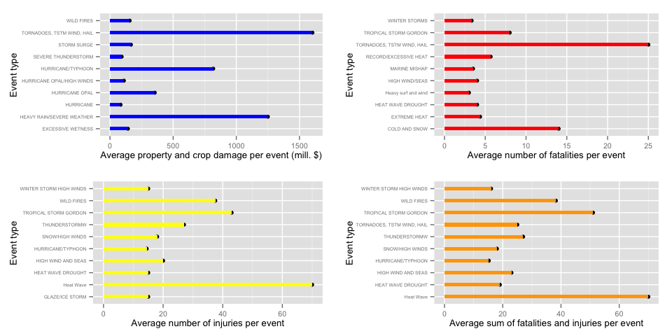
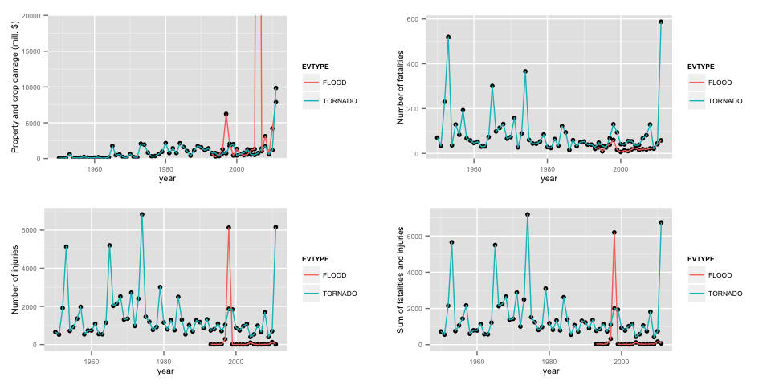

# Exploring The NOOA Storm Database
Bodil Biering  
17 Nov 2014  


***
#### *Synopsis* 
**Questions:**
In this data analysis we investigate the following questions:

1. Across the United States, which types of events (as indicated in the EVTYPE variable) are most harmful with respect to population health?

2. Across the United States, which types of events have the greatest economic consequences?  

The analysis demonstrates that while tornados are the most harmful events with respect to population health, floods have the greatest economic consequences.
For the flood and tornado events we report the impact on population health and economy over time.

***
## Introduction

*Storms and other severe weather events can cause both public health and economic problems for communities and municipalities. Many severe events can result in fatalities, injuries, and property damage, and preventing such outcomes to the extent possible is a key concern.*

*This project involves exploring the U.S. National Oceanic and Atmospheric Administration's (NOAA) storm database. This database tracks characteristics of major storms and weather events in the United States, including when and where they occur, as well as estimates of any fatalities, injuries, and property damage.*

*The events in the database start in the year 1950 and end in November 2011. In the earlier years of the database there are generally fewer events recorded, most likely due to a lack of good records. More recent years should be considered more complete.*

## Data Processing

The data is processed as follows:

* Read the csv.bz2 file from the data folder.
* Tidy the data by transforming alphabetical characters signifying the magnitude of the number in the damage column to a number, and then multiply by this number to get the damage estimates.
Note, that we do not take into acount any additional presision, since we are interested in the "large picture".
From the documentation of the NOOA storm database:

> *Estimates can be obtained from emergency managers, U.S. Geological Survey, U.S. Army Corps of Engineers, power utility companies, and newspaper articles. If the values provided are rough estimates, then this should be stated as such in the narrative. Estimates should be rounded to three significant digits, followed by an alphabetical character signifying the magnitude of the number, i.e., 1.55B for $1,550,000,000. Alphabetical characters used to signify magnitude include “K” for thousands, “M” for millions, and “B” for billions. If additional precision is available, it may be provided in the narrative part of the entry. When damage is due to more than one element of the storm, indicate, when possible, the amount of damage caused by each element. If the dollar amount of damage is unknown, or not available, check the “no information available” box.*

* Convert the estimates to million dollars.


* We use the following libraries:

```r
#load libraries
library(dplyr)
library(lubridate)
library(ggplot2)
require(gridExtra)
require(knitr)
```


```r
#load data
data = read.csv("./data/repdata-data-StormData.csv.bz2", sep = ",", stringsAsFactors=TRUE)

# function for translating letters to numbers
f <- function(c) {
    if(c == "B" || c == "b") { return(1e+09) } 
    else if(c == "M" || c == "m") { return(1e+06) } 
    else if(c == "K" || c == "k") { return(1000) }
    else if(c == "H" || c == "h") { return(100) } 
    else return(1) }

# make total in mill dollars
tidydata <- mutate(data, 
                   propDmgFact = sapply(PROPDMGEXP, f), 
                   cropDmgFact = sapply(CROPDMGEXP, f), 
                   totalDmg = (PROPDMG * propDmgFact + CROPDMG * cropDmgFact)/1e+06)
# convert date format
tidydata$BGN_DATE <- mdy_hms(tidydata$BGN_DATE)
```


* We group the data by event type in a new frame ```by_evtype``` in order to calculate the sum and mean for each event type.

```r
# group by event type and calculate numbers by event type
by_evtype <- group_by(tidydata, EVTYPE) %>% 
    summarise(fatalities = sum(FATALITIES), meanFatal = mean(FATALITIES), 
              injuries = sum(INJURIES), meanInjuries = mean(INJURIES), 
              totalDamage = sum(totalDmg), meanDmg = mean(totalDmg), 
              sumHealth = sum(FATALITIES) + sum(INJURIES), 
              meanSumHealth = mean(FATALITIES + INJURIES), count = length(EVTYPE))
```

* Likewise we group data by year in a new frame ```by_year``` in order to calculate the sum and mean for each year for specific event types **flood** and **tornado**.

```r
by_year <- group_by(tidydata, EVTYPE, year =year(BGN_DATE)) %>% 
    filter(EVTYPE == "TORNADO" | EVTYPE =="FLOOD") %>%
    summarise(fatalities = sum(FATALITIES), meanFatal = mean(FATALITIES), 
              injuries = sum(INJURIES), meanInjuries = mean(INJURIES), 
              totalDamage = sum(totalDmg), meanDmg = mean(totalDmg), 
              sumHealth = sum(FATALITIES) + sum(INJURIES), 
              meanSumHealth = mean(FATALITIES + INJURIES), count = length(EVTYPE))
```


## Results

### Total Impact By Event Types

```r
# plots:
 plot1 <- qplot(EVTYPE, totalDamage, data = arrange(by_evtype, desc(totalDamage))[1:10,]) + geom_bar(stat = "identity", fill = "blue", width=0.3)  + ylab("Total property and crop damage (mill. $)") + xlab("Event type") + theme( text = element_text(size = 10), axis.text.y = element_text(size=5)) + coord_flip()

plot2 <- qplot(EVTYPE, fatalities, data = arrange(by_evtype, desc(fatalities))[1:10,]) + geom_bar(stat = "identity", fill = "red", width=0.3) + xlab("Event type") + ylab("Total number of fatalities by event type") + theme(text = element_text(size = 10), axis.text.y = element_text(size=5)) + coord_flip()

plot3 <- qplot(EVTYPE, injuries, data = arrange(by_evtype, desc(injuries))[1:10,]) + geom_bar(stat = "identity", fill = "yellow", width=0.3) + xlab("Event type") + ylab("Total number of injuries by event type") + theme(text = element_text(size = 10), axis.text.y = element_text(size=5)) + coord_flip()

plot4 <- qplot(EVTYPE, sumHealth, data = arrange(by_evtype, desc(sumHealth))[1:10,]) + geom_bar(stat = "identity", fill = "orange", width=0.3) + xlab("Event type") + ylab("Sum of fatalities and injuries by event type") + theme(text = element_text(size = 10), axis.text.y = element_text(size=5)) + coord_flip()

grid.arrange(plot1, plot2,plot3, plot4, nrow = 2, ncol=2)
```

 

The plots above show the top ten event types when cosidering the total amount of property and crop damage, the total number of fatalities, the total number of injuries and finally, the total number of fatalities plus injuries.

#### Economic Consequences
The plots show that the event type with the by far largest economic consequences is flood, which in total since the 1950's has caused damages for 150000 mill. dollars.
Other event types that have large economic consequences are huricane, tornado and storm.

#### Population Health
Tornados are by far the most dangerous event type both with respect to fatalities and injuries, tornados has killed and injured nearly 100000 people in the US since the 1950's.
Excessive heat is also responsible for many fatalities.

### Average Impact By Event Types

```r
plot5 <- qplot(EVTYPE, meanDmg, data = arrange(by_evtype, desc(meanDmg))[1:10,]) + geom_bar(stat = "identity", fill = "blue", width=0.3)  + ylab("Average property and crop damage per event (mill. $)") + xlab("Event type") + theme( text = element_text(size = 10), axis.text.y = element_text(size=5)) + coord_flip()

plot6 <- qplot(EVTYPE, meanFatal, data = arrange(by_evtype, desc(meanFatal))[1:10,]) + geom_bar(stat = "identity", fill = "red", width=0.3) + xlab("Event type") + ylab("Average number of fatalities per event") + theme( text = element_text(size = 10), axis.text.y = element_text(size=5)) + coord_flip()

plot7 <- qplot(EVTYPE, meanInjuries, data = arrange(by_evtype, desc(meanInjuries))[1:10,]) + geom_bar(stat = "identity", fill = "yellow", width=0.3) + xlab("Event type") + ylab("Average number of injuries per event") + theme( text = element_text(size = 10), axis.text.y = element_text(size=5))  + coord_flip()

plot8 <- qplot(EVTYPE, meanSumHealth, data = arrange(by_evtype, desc(meanSumHealth))[1:10,]) + geom_bar(stat = "identity", fill = "orange", width=0.3) + xlab("Event type") + ylab("Average sum of fatalities and injuries per event") + theme( text = element_text(size = 10), axis.text.y = element_text(size=5)) + coord_flip()

grid.arrange(plot5, plot6, plot7, plot8, nrow = 2, ncol=2)
```

 

The figure above shows the average damage, fatalities and injuries.
This tells us which event types have the gretest impact in a single occurence. However, one must be careful when concluding from these values, since some of the reported event types may consist of only a single event which had large impact.

###Most Common Event Types

It may also be interesting to see which event types occures often. The table below shows the frequence of the most common (i.e., most frequent) event types:

```r
t <- arrange(by_evtype, desc(count))
kable(t[1:20,c("EVTYPE", "count")], format = "markdown")
```


|EVTYPE                   |  count|
|:------------------------|------:|
|HAIL                     | 288661|
|TSTM WIND                | 219940|
|THUNDERSTORM WIND        |  82563|
|TORNADO                  |  60652|
|FLASH FLOOD              |  54277|
|FLOOD                    |  25326|
|THUNDERSTORM WINDS       |  20843|
|HIGH WIND                |  20212|
|LIGHTNING                |  15754|
|HEAVY SNOW               |  15708|
|HEAVY RAIN               |  11723|
|WINTER STORM             |  11433|
|WINTER WEATHER           |   7026|
|FUNNEL CLOUD             |   6839|
|MARINE TSTM WIND         |   6175|
|MARINE THUNDERSTORM WIND |   5812|
|WATERSPOUT               |   3796|
|STRONG WIND              |   3566|
|URBAN/SML STREAM FLD     |   3392|
|WILDFIRE                 |   2761|

### Impact of Tornados and Floods Over Time

```r
#plotting by year
plota <- qplot(year, totalDamage, data = by_year) + geom_line(aes(group = EVTYPE, colour = EVTYPE)) + coord_cartesian(ylim = c(0, 20000)) + ylab("Property and crop damage (mill. $)") + theme( text = element_text(size = 8))

plotb <- qplot(year, fatalities, data = by_year) + geom_line(aes(group = EVTYPE, colour = EVTYPE)) + ylab("Number of fatalities") + theme( text = element_text(size = 8))

plotc <- qplot(year, injuries, data = by_year) + geom_line(aes(group = EVTYPE, colour = EVTYPE)) + ylab("Number of injuries") + theme( text = element_text(size = 8))

plotd <- qplot(year, sumHealth, data = by_year) + geom_line(aes(group = EVTYPE, colour = EVTYPE)) + ylab("Sum of fatalities and injuries") + theme( text = element_text(size = 8))

grid.arrange(plota, plotb, plotc, plotd, nrow = 2, ncol=2)
```

 

The figure above shows the impact of tornados and flood over time, summing the numbers for each year. Notice that, while tornados have been reported since the 1950s, floods have not been reported before the 1990s.

####Extreme outlier responsible for most of the flood damage
Notice that for flood we have an extreme outlier with value:

```r
flood <- filter(by_year, EVTYPE =="FLOOD")
max(flood$totalDamage)
```

```
## [1] 116611.3
```

That is, in one particular year (2006) there was a total reporting of damages for 116611.3 mill. dollars,
which accounts for most of the grand total of flood damage:

```r
sum(flood$totalDamage)
```

```
## [1] 150319.7
```

****
### Software environment used to produce this report


```r
sessionInfo()
```

```
## R version 3.1.1 (2014-07-10)
## Platform: x86_64-apple-darwin13.1.0 (64-bit)
## 
## locale:
## [1] en_US.UTF-8/en_US.UTF-8/en_US.UTF-8/C/en_US.UTF-8/en_US.UTF-8
## 
## attached base packages:
## [1] grid      stats     graphics  grDevices utils     datasets  methods  
## [8] base     
## 
## other attached packages:
## [1] knitr_1.8       gridExtra_0.9.1 ggplot2_1.0.0   lubridate_1.3.3
## [5] dplyr_0.2      
## 
## loaded via a namespace (and not attached):
##  [1] assertthat_0.1   colorspace_1.2-4 digest_0.6.4     evaluate_0.5.5  
##  [5] formatR_1.0      gtable_0.1.2     htmltools_0.2.4  labeling_0.3    
##  [9] magrittr_1.0.1   MASS_7.3-33      memoise_0.2.1    munsell_0.4.2   
## [13] parallel_3.1.1   plyr_1.8.1       proto_0.3-10     Rcpp_0.11.2     
## [17] reshape2_1.4     rmarkdown_0.2.54 scales_0.2.4     stringr_0.6.2   
## [21] tools_3.1.1      yaml_2.1.13
```
